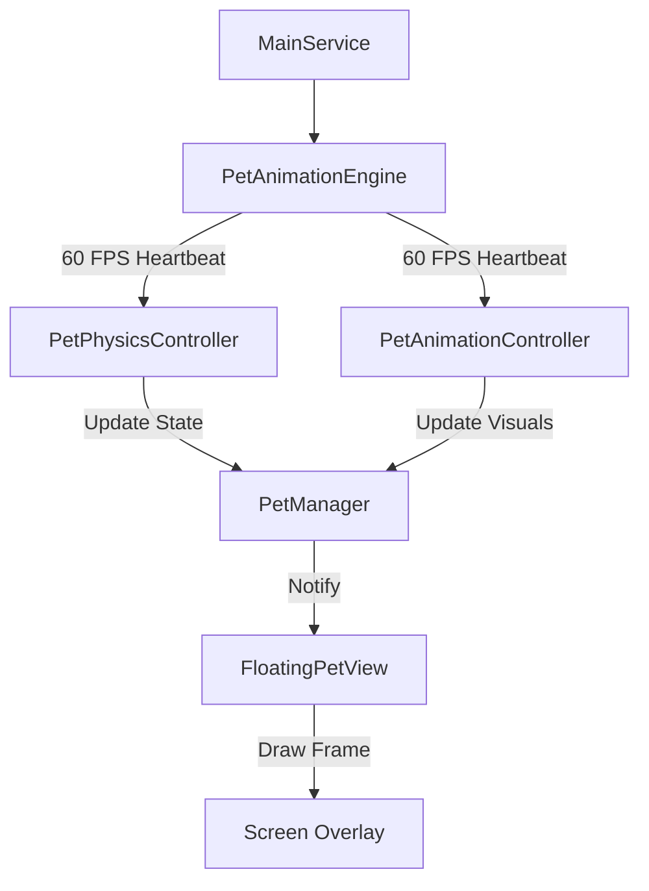

# Companion Shimejis (Digital Pets) for Android

**Companion Shimejis** is an Android application that brings delightful, interactive digital pets to your screen. Unlike static wallpapers, these pets live in an overlay layer, allowing them to follow you across different apps, interact with your screen, and provide a sense of companionship.

---

## 🌟 Current Features (MVP)

The project currently supports the following core "Minimum Viable Product" features:
- **System Overlay Pets**: Characters are drawn over other applications using the `SYSTEM_ALERT_WINDOW` permission.
- **Multi-Pet Support**: Spawn and manage multiple pets simultaneously.
- **Drag & Drop**: Manually reposition pets anywhere on your screen.
- **Basic Physics**: Simple movement and boundary detection.
- **Foreground Service Lifecycle**: A robust foreground service ensures pets stay active even when the app is closed, with automatic pausing when the screen is off to save battery.

---

## 🛠️ Getting Started

### Prerequisites
- **Android Device**: Supports Android 8.0 (API 26) and above.
- **Overlay Permission**: The app requires the "Draw over other apps" permission to function.

### Installation
1. Clone the repository.
2. Build and run the app using Android Studio.
3. Upon first launch, the app will request the necessary overlay permission.
4. Select your favorite pets from the dashboard and toggle "Start Pets Floating".

---

## 🧠 Design Philosophy

Our development is guided by a commitment to **Believable Companionship**:
- **On-Device Logic**: All behavior is calculated locally; no cloud dependencies.
- **Privacy First**: No accessibility abuse, no screen reading, and no input monitoring.
- **Deterministic Behavior**: Actions are explainable and testable, not chaotic.
- **Polite UX**: The pets are guests on your screen; they never disrupt your work or hide critical UI elements.

---

## 🚀 Future Enhancements & Roadmap

We are committed to bringing these pets to life through incremental, ethical, and technically realistic updates.

### Phase 1: Behavior & Animation Foundation
- **Behavior State Machine**: Moving from chaotic physics to intentional states (IDLE, WALK, FALL, SLEEP, INTERACT).
- **Sprite Sheet Animation**: Support for frame-based animations for fluid movements (Sit, Sleep, Climb).
- **Interaction Polish**: Dedicated animations for dragging and tapping.

### Phase 2: Desktop-Grade "Shimeji" Feel
- **Gravity & Surface Affinity**: Pets will fall to the "floor" (screen bottom) and walk along edges instead of floating randomly.
- **Climbing & Hanging**: Pets will be able to climb the sides of your screen or hang from the top notification bar.

### Phase 3: Emotional Continuity
- **Mood Model**: Lightweight internal stats like Energy, Mood (Happy/Bored), and Affinity (bond with the user).
- **Personality Profiles**: Distinct behavior multipliers (e.g., a "Lazy" pet vs. a "Playful" pet).

### Phase 4: Context Awareness
- **System Signals**: Reacting to time of day, battery levels, charging state, and DND (Do Not Disturb) mode.

---

## 🔋 Performance & Battery Strategy
We prioritize your device's health:
- Shared frame tickers to minimize CPU usage.
- Frame rate throttling when pets are idle.
- Zero "busy loops" and minimal memory allocations.

---

## 🚫 Non-Goals
To maintain user trust, we will **never**:
- Use Accessibility Services.
- Read your screen or track app usage.
- Send push notification spam.
- Require "Always-on" listening or microphones.

---
---

# 🏗️ Technical Documentation

This section provides a deep dive into the architecture, component layers, and internal logic that drive the experience for future developers.

## Architecture Overview

The project follows a **Service-driven Overlay Architecture**. Because the pets must persist while the user interacts with other applications, a `Foreground Service` acts as the primary orchestrator.

### Component Interaction Flow (The "Game Loop")

---

## 📦 Component Layers & Intent

The project is organized into functional packages, each with a specific intent:

### 1. Service Layer (`service`)
*   **Intent**: Orchestration and lifecycle persistence.
*   **Core Class**: `MainService`
*   **Responsibility**: Initializes all engines, handles system events (screen on/off), and manages the foreground notification.

### 2. Management Layer (`manager`)
*   **Intent**: Bridging logical states to physical views.
*   **Core Class**: `PetManager`
*   **Responsibility**: Handles adding/removing pets from the window, syncing their scale/opacity, and maintaining the list of `activePets`.

### 3. Physics & Behavioral Logic (`physics`)
*   **Intent**: Calculating motion and behavior transitions.
*   **Core Class**: `PetPhysicsController`
*   **Responsibility**: Calculates boundary collisions, gravity, and transition probabilities.

### 4. Animation Engine (`animation`)
*   **Intent**: Timing and frame-based sprite rendering.
*   **Core Classes**: `PetAnimationEngine`, `PetAnimationController`
*   **Responsibility**: `Engine` provides the `Handler`-driven loop; `Controller` slices sprite sheets dynamically based on behavior.

### 5. Overlay & UI Layer (`overlay`)
*   **Intent**: Managing WindowManager operations.
*   **Core Classes**: `PetWindowManager`, `FloatingPetView`
*   **Responsibility**: Abstraction for `WindowManager.addView/updateView`; custom `View` rendering via `Canvas` and `srcRect` slicing.

---

## 🛠️ Key Classes & Responsibilities

| Class | Package | Responsibility |
| :--- | :--- | :--- |
| `MainService` | `service` | The root entry point; starts/stops the animation heartbeats. |
| `PetManager` | `manager` | Factory for `PetState`; attaches `PetTouchHandler` to views. |
| `PetPhysicsController` | `physics` | Updates `x, y` and `behavior` based on screen bounds and gravity. |
| `PetAnimationController`| `animation` | Maps `PetBehavior` to sprite sheet rows and calculates dynamic frame indices. |
| `PetWindowManager` | `overlay` | Handles `TYPE_APPLICATION_OVERLAY` params and safe view removal. |
| `FloatingPetView` | `overlay` | Custom view that draws specific sprite frames using `Rect` slicing. |
| `PetTouchHandler` | `interaction` | Distinguishes between drags, taps, and long-presses for interaction. |
| `PetSessionManager` | `persistence` | Restores pet types and positions across service restarts. |

---

## 📈 Future Technical Improvements

- **Behavioral Tree**: Moving from a simple State Machine to a Behavior Tree for more complex "living" pet logic.
- **Smart Slicing**: Abstracting the Animation Controller to support variable grid sizes for importing 3rd party Shimeji packs.
- **Reactive Collision**: Implementing AABB (Axis-Aligned Bounding Box) detection for pet-to-pet interaction.
- **Performance Throttling**: Implementing a dynamic tick rate where Idle pets update less frequently.
- **Dependency Injection**: Introducing Hilt/Dagger to manage component lifecycles properly.

---

## 🚫 Dev Constraints
- **Low Memory**: Avoid excessive Bitmap allocations; cache sprite sheets in `bitmapCache`.
- **Zero Jitters**: All View updates must happen on the Main Thread synchronized with the animation loop.
- **Boundary Safety**: Always coerce positions within `usableBounds` (accounting for insets and notches).
